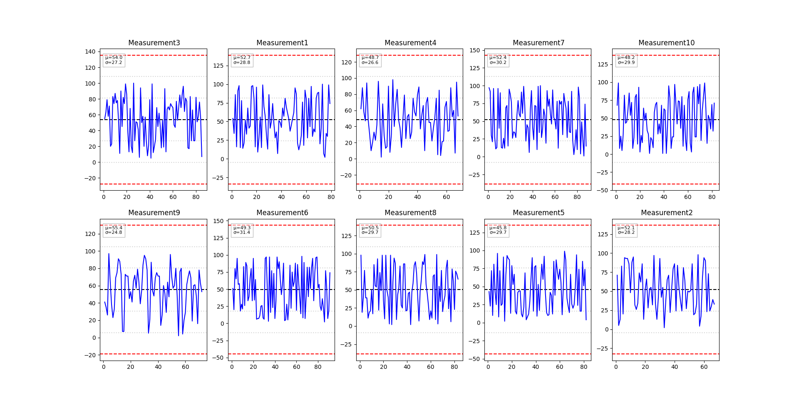

# URQSpanServer


This project is a server-side Python application designed to collect and display measurements made by a QSpan measurement system on a UR robot. Socket messages sent by the robot are collected, plotted, and saved in 'measurements.csv'. Plotting is done on a multi-axis matplotlib plot, and data is logged in the following format f"{name},{value}". Socket messages are expected to follow a f"{name}:{value}" format as in Q-Span's measure block in PolyScope.


## Table of Contents
- [Installation](#installation)
- [Usage](#usage)
- [Features](#features)
- [Contributing](#contributing)
- [License](#license)
- [Screenshots](#screenshots)


## Installation


1. Clone the repository:
   ```bash
   git clone https://github.com/Vishwesh9000/URQSpanServer.git
   ```


2. Navigate to the project directory:
   ```bash
   cd URQSpanServer
   ```


3. Install the necessary dependencies:
   ```bash
   pip install -r requirements.txt
   ```


## Usage


### Running the Server
The UR robot must be set up with your computer's IPv4 from the Ethernet connection with the robot (Can be found using ipconfig in cmd) and a port number (default is 55400).


Then, set the same IP address and port in the sock.bind() function inside listenForMeasurements().


Run the server script with the following command:
```bash
python server.py
```
A blank matplotlib window should show up


### Running the robot
Play either the PolyScope or URScript program on the robot.


The measurements should show up in the matplotlib graph


### Running the test script
Run python testScript.py in a separate terminal after starting up the server


Random point (1-100) on random measurements (1-10) should show up on the server's graph


## Features


- Data visualization: Client script plots measurement data with `matplotlib`, including mean, median, and standard deviation, written and graphed.
- Logging: Logs the data received into 'measurements.csv' (f"{name},{value}") for exporting into other software.
- Automatic IP selection: The server script automatically searches for isolated Ethernet connections (Prioritizes 169.254.x.x networks) and selects the first available connection if none are found. Can be disabled by removing the findIP() call in listenForMeasurements() and replacing it with a hardcoded IP. (NOTE: Port selection is still manual)


## Contributing


If you want to contribute to this project, follow these steps:


1. Fork the repository.
2. Create a new branch (`git checkout -b feature-branch`).
3. Make your changes.
4. Commit your changes (`git commit -m 'Add new feature'`).
5. Push to your branch (`git push origin feature-branch`).
6. Open a pull request.


Please follow the existing coding style and write clear commit messages.


## License


This project is licensed under the MIT License.  
See the [LICENSE](LICENSE) file for details.


## Screenshots


Here’s a screenshot of the server plotting data:





